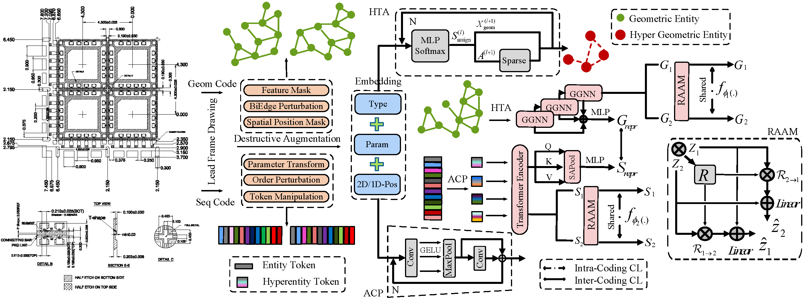

# DualDXF: Holistic Representation Learning for CAD Drawings

## 🎯 Abstract

This repository provides the official implementation for our paper:

**DualDXF: Holistic Representation Learning for CAD Drawings via Dual-Coding of Drawing Exchange Format**

## 🏗️ Architecture

<div align="center">
  
  <p><em>Overall Framework of Holistic Representation Learning for Drawings in DualDXF</em></p>
</div>

## 📋 Prerequisites

- 🐧 **Linux** (Ubuntu 18.04+ recommended)
- 🚀 **NVIDIA GPU** with CUDA 11.0+ and cuDNN 8.0+
- 🐍 **Python 3.8+**, PyTorch 1.9.0+

## 🛠️ Installation

### Clone the repository
```bash
git clone https://github.com/HeCunr/DualDXF.git
cd DualDXF
```

### Install other dependencies
```bash
pip install -r requirements.txt
```

## 📊 Dataset Structure

```
data/
├── 📁 DXF/                     # Raw DXF Files
│   ├── SuperLFD_train/
│   │   └── *.dxf
│   └── SuperLFD_evaluate/
│       └── *.dxf
├── 📁 Geom/                    # Geometric Data
│   ├── SuperLFD_train/
│   │   └── *.json              # Node features & Adj & Pos
│   └── SuperLFD_evaluate/
│       └── *.json
├── 📁 Seq/                     # Sequential Data  
│   ├── SuperLFD_train/
│   │   └── *.h5                # Entity Sequences
│   └── SuperLFD_evaluate/
│       └── *.h5
└── 📁 group/                   # Grouping Metadata
    └── SuperLFD_evaluate.txt   # Similarity Ground Truth
```

## ⚙️ Configuration

**Important:** Adjust the following parameters based on your DXF complexity and hardware configuration.

## 🔄 Data Preprocessing

### Generate Geometric Data
Extract geometric features and build adjacency graphs:

```bash
python Geom_process.py
```

### Generate Sequential Data
Parse entity sequences and export to HDF5 format:

```bash
python Seq_process.py
```

## 🚀 Training

Train with default configuration:

```bash
python train.py
```

## 📈 Evaluation

### Similarity Assessment
Compare two DXF files:

```bash
python sim.py --dxf1_h5 data/Seq/file1.h5 --dxf1_json data/Geom/file1.json \
              --dxf2_h5 data/Seq/file2.h5 --dxf2_json data/Geom/file2.json
```

### Retrieval Evaluation
Run retrieval benchmarks (AP@K, Recall@K, NDCG@K):

```bash
python MRD.py --geom_dir data/Geom/SuperLFD_evaluate \
              --seq_dir data/Seq/SuperLFD_evaluate \
              --model_ckpt checkpoints/Dual_best.pth
```

## 📖 Citation

If you find this work useful for your research, please cite:

```bibtex
@article{hecunr2024dualdxf,
  title={DualDXF: Holistic Representation Learning for CAD Drawings via Dual-Coding of Drawing Exchange Format},
  author={HeCunr and Authors},
  journal={Conference/Journal Name},
  year={2024}
}
```

## 📜 License

This project is licensed under the MIT License - see the [LICENSE](LICENSE) file for details.

## 🤝 Contributing

Contributions are welcome! Please feel free to submit a Pull Request.

## 📧 Contact

For any questions or issues, please contact: [102201525@fzu.edu.cn](mailto:102201525@fzu.edu.cn)

---

<div align="center">
  <p>⭐ If you find this project helpful, please consider giving it a star! ⭐</p>
</div>
